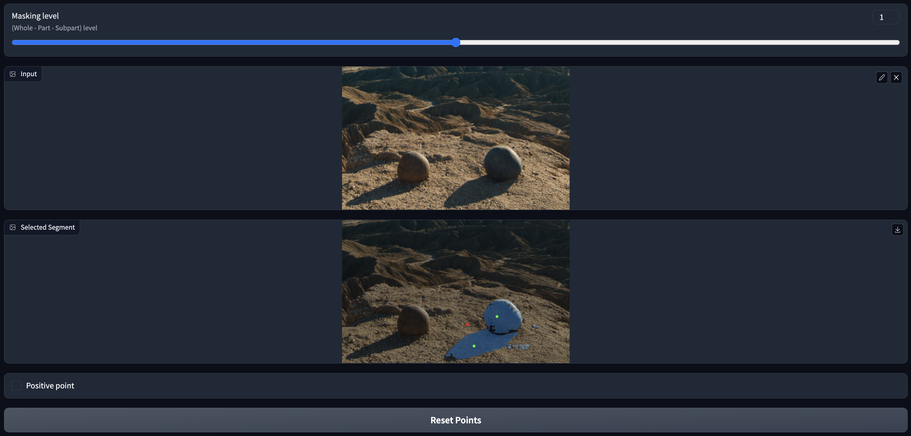

# Interactive SAM Demo with Gradio

This is a demo application on Segment Anything Model with user point prompts.



Segment Anything Model ([SAM](https://github.com/facebookresearch/segment-anything)) is a segmentation foundation model recently released by Facebook Research, capable of segmenting literally anything in an image with remarkable accuracy. Its basic function is to segment objects indicated by user prompts such as points, boxes, and masks.

Gradio, a machine learning tool for building UIs, has recently added support for [getting image coordinates of mouse clicks](https://github.com/gradio-app/gradio/pull/3786), which is utilized in this application.

## Main functions

- Give positive, negative points
- FP16 inference for faster inference

## Quick Start

```bash
git clone https://github.com/nijkah/Interactive-SAM-with-Gradio
cd interative_sam_gradio_demo
pip install -r requirements.txt

python3 main.py
```

## Acknowledgement

```
@article{kirillov2023segany,
  title={Segment Anything},
  author={Kirillov, Alexander and Mintun, Eric and Ravi, Nikhila and Mao, Hanzi and Rolland, Chloe and Gustafson, Laura and Xiao, Tete and Whitehead, Spencer and Berg, Alexander C. and Lo, Wan-Yen and Doll{\'a}r, Piotr and Girshick, Ross},
  journal={arXiv:2304.02643},
  year={2023}
}

@article{abid2019gradio,
  title = {Gradio: Hassle-Free Sharing and Testing of ML Models in the Wild},
  author = {Abid, Abubakar and Abdalla, Ali and Abid, Ali and Khan, Dawood and Alfozan, Abdulrahman and Zou, James},
  journal = {arXiv preprint arXiv:1906.02569},
  year = {2019},
}
```
